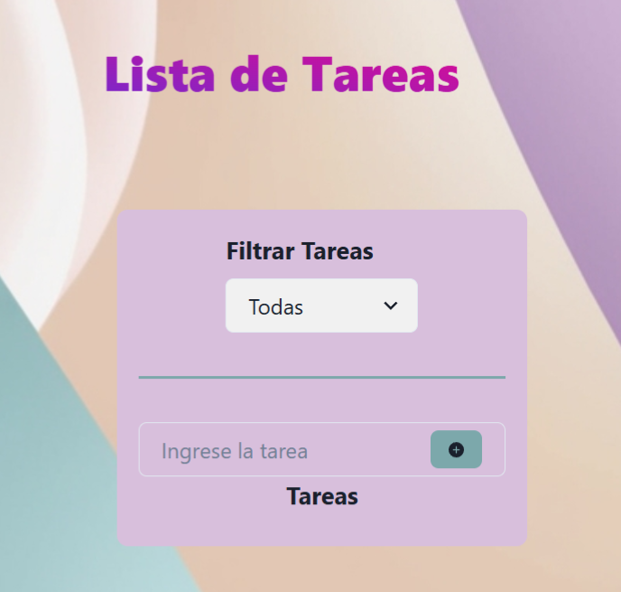
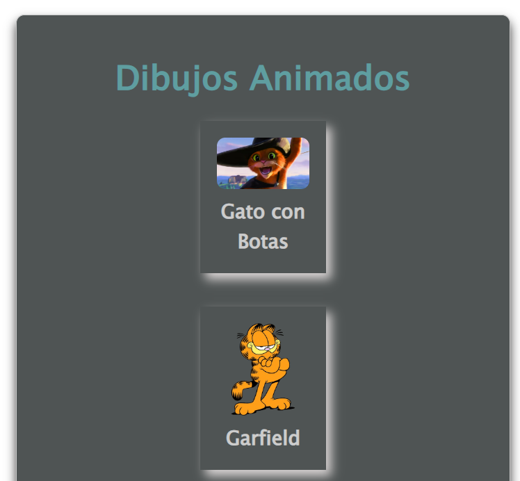

# **Portafolio de Melina**
Bienvenidos a mi portafolio personal. Soy Analista en Sistemas y Desarrolladora Web. Aquí encontrarás una colección de mis proyectos, habilidades y una pequeña sección sobre mí. Este portafolio está hecho utilizando HTML, CSS y JavaScript.

---

## 🚀 **Características**
- ** Proyectos destacados: Muestra mis proyectos más representativos, con detalles de cada uno.
- ** Diseño responsivo: Adaptable para dispositivos móviles y de escritorio.
- **Interacción sencilla: Usando solo HTML, CSS y JavaScript para ofrecer una experiencia fluida y rápida.

---

## 🛠️ **Tecnologías utilizadas**

- ** HTML: Estructura y contenido de las páginas.
- ** CSS: Estilos y diseño responsivo.
- ** JavaScript: Para agregar interactividad, como el cambio de tema y efectos en los botones.
- ** GitHub: Para la gestión del código y la implementación de cambios.

---

## 📦 **Instalación**
Si deseas ver mi portafolio en tu máquina local, sigue estos pasos:

1️⃣ Clona el repositorio:

git clone https://github.com/melina8444/mi-portafolio.git
cd mi-portafolio

2️⃣ Abre el archivo index.html en tu navegador:

# Solo abre el archivo en tu navegador

open index.html

- ** No necesitas instalar dependencias ni usar un servidor, simplemente abre el archivo HTML en tu navegador para ver el portafolio.

---

## 🖼️ **Capturas de pantalla**
Algunas imágenes de mi portafolio:

- ** Vista principal: Pantalla de inicio de mi portafolio.
- ** Proyectos: Sección donde puedes ver los proyectos con sus respectivas descripciones y enlaces.
- ** Habilidades: Muestra las tecnologías y lenguajes que manejo.

---

## 📚 **Cómo usar**
1️⃣ Explora la sección de proyectos: Aquí puedes ver ejemplos de mi trabajo con enlaces a cada uno.

2️⃣ Consulta mis habilidades: Una lista de las tecnologías que utilizo en el desarrollo web.

3️⃣ Modo oscuro: Puedes cambiar entre el modo claro y oscuro para una mejor experiencia visual.

📩 Contacto
Si tienes alguna pregunta o sugerencia, no dudes en contactarme:

GitHub: melina8444
Email: melinayanguez@gmail.com